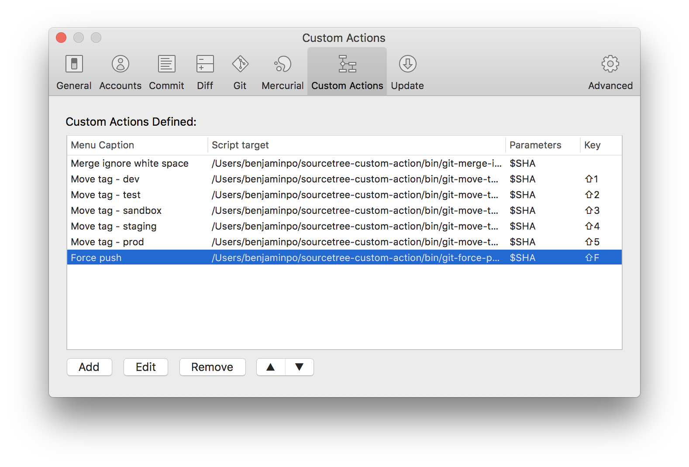

# sourcetree-custom-action

## Files

### git-force-push.sh

just simply force push

Parameters: NA
### git-merge-ignore-white-space.sh

git merge ignore whitespace changes

Parameters: $SHA

Advanced Merge based on [Advanced Merging - Official Git Website](https://git-scm.com/book/en/v2/Git-Tools-Advanced-Merging)

### git-move-tag-xxx.sh

move git (dev/test/sandbox/staging/prod) tag to any commit

Parameters: $SHA

## Note
Required manual refresh (command+r) after perform custom action
